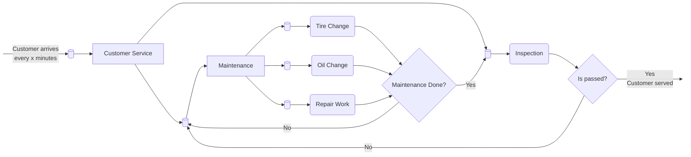
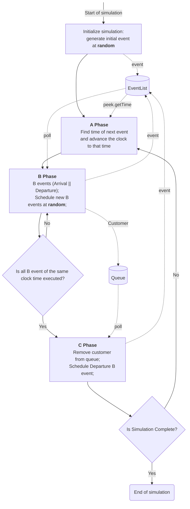

```mermaid
---
config:
  layout: fixed
  theme: default
---
flowchart LR
    nowhere1[" "] -- Customer arrives <br> every x minutes --> queue1[(" ")]
    queue1 --> customerService["Customer Service"]
    customerService --> queueMaintenance[(" ")] & queueInspection[(" ")]
    queueMaintenance --> maintenance["Maintenance"]
    queueInspection --> inspection("Inspection")
    maintenance --> tireQueue[(" ")] & oilQueue[(" ")] & repairQueue[(" ")]
    tireQueue --> tireChange("Tire Change")
    oilQueue --> oilChange("Oil Change")
    repairQueue --> repairWork("Repair Work")
    tireChange --> maintenanceDone{"Maintenance Done?"}
    oilChange --> maintenanceDone
    repairWork --> maintenanceDone
    maintenanceDone -- Yes --> queueInspection
    maintenanceDone -- No --> queueMaintenance
    inspection --> isPassed{"Is passed?"}
    isPassed -- Yes <br> Customer served --> customerServed[" "]
    isPassed -- No --> queueMaintenance
    style nowhere1 width:0px
    style customerServed width:0px
```

```mermaid
flowchart TD
    start[" "] -- Start of simulation --> init["Initialize simulation:
        generate initial event at <b>random</b>"]
    init -. event .-> eventList[("EventList")]
    init --> A["<b>A Phase</b>
        Find time of next event
        and advance the clock to that time"]
    eventList -. "peek.getTime" .-> A
    A --> B["<b>B Phase</b>
        B events (Arrival || Departure);
        Schedule new B events at <b>random</b>;"]
    eventList -. poll .-> B
    B -. event .-> eventList
    B -. Customer .-> queue[("Queue")]
    B --> logic2{"Is all B event of the same clock time executed?"}
    logic2 -- Yes --> C["<b>C Phase</b>
        Remove customer from queue;
        Schedule Departure B event;"]
    logic2 -- No --> B
    queue -. poll .-> C
    C -. event .-> eventList
    C --> logic1{"Is Simulation Complete?"}
    logic1 -- Yes --> endofsim("End of simulation")
    logic1 -- No --> A
    
    style start height:0px
```
