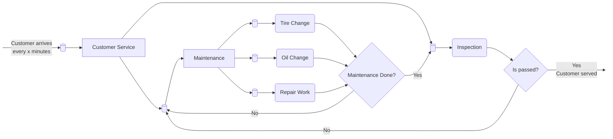

```mermaid
---
config:
  layout: fixed
  theme: default
---
flowchart LR
    nowhere1[" "] -- Customer arrives <br> every x minutes --> queue1[(" ")]
    queue1 --> customerService["Customer Service"]
    customerService --> queueMaintenance[(" ")] & queueInspection[(" ")]
    queueMaintenance --> maintenance["Maintenance"]
    queueInspection --> inspection("Inspection")
    maintenance --> tireQueue[(" ")] & oilQueue[(" ")] & repairQueue[(" ")]
    tireQueue --> tireChange("Tire Change")
    oilQueue --> oilChange("Oil Change")
    repairQueue --> repairWork("Repair Work")
    tireChange --> maintenanceDone{"Maintenance Done?"}
    oilChange --> maintenanceDone
    repairWork --> maintenanceDone
    maintenanceDone -- Yes --> queueInspection
    maintenanceDone -- No --> queueMaintenance
    inspection --> isPassed{"Is passed?"}
    isPassed -- Yes <br> Customer served --> customerServed[" "]
    isPassed -- No --> queueMaintenance
    style nowhere1 width:0px
    style customerServed width:0px
```
