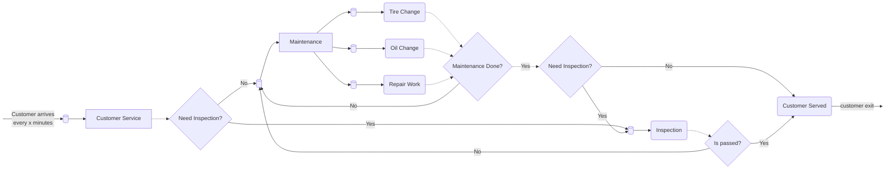
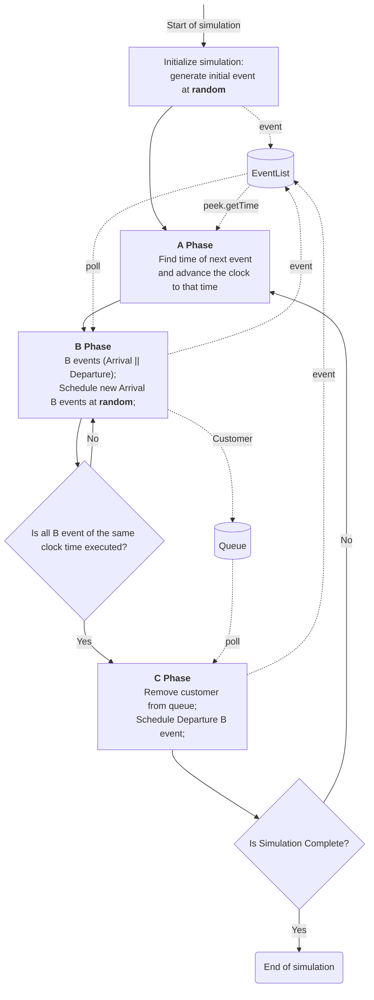

# 🚗 Car-Garage Simulation (Java)

# Overview
The Car Garage Simulation is a Java-based application that models the operations of a modern automotive garage. This object-oriented program demonstrates key Java concepts including inheritance, polymorphism, collections, and exception han-dling while simulating real-world garage operations.
Car garages manage complex operation involving multiple vehicles, each requiring different services such as maintenance, repair, or inspection. Managing these oper-ations manually can lead to inefficiency, errors and delayed service. The “Car Gar-age Simulation” project aims to digitally model these operations with specialized service.

---

# 🌟 Features
* Simulate customers arriving at the garage at fixed time intervals.  
* Process customers through **Customer Service**, **Inspection**, and **Maintenance**.  
* Maintenance includes **Tire Change, Oil Change, and Repair Work**.  
* Queue management for Inspection and Maintenance.  
* Re-inspection loop for cars that fail inspection.  
* Track when customers are served and exit the system. 

---

# Contribution instructions
1. Create a new branch.
2. Commit changes to the new branch created.
3. If you are done with your changes, create a pull request to the main branch, and describe your changes.
4. Wait for everyone's approval before merging your pull request.

# Flowchart how the Car-Garage Simulation works

# Simulation Instructions
