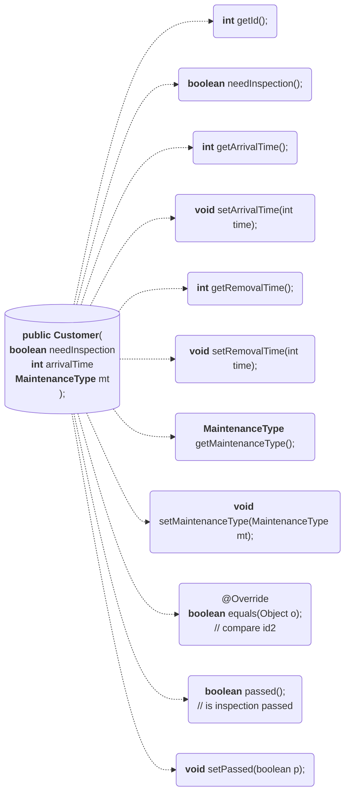
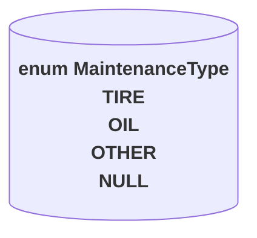

```mermaid
flowchart LR
    customer[("<b>public Customer</b>(
        <b>boolean</b> needInspection
        <b>int</b> arrivalTime
        <b>MaintenanceType</b> mt
    );")]
    
    customer -.-> getId("<b>int</b> getId();")
    customer -.-> needInspection("<b>boolean</b> needInspection();")
    customer -.-> getArrivalTime("<b>int</b> getArrivalTime();")
    customer -.-> setArrivalTime("<b>void</b> setArrivalTime(int time);")
    customer -.-> getRemovalTime("<b>int</b> getRemovalTime();")
    customer -.-> setRemovalTime("<b>void</b> setRemovalTime(int time);")
    customer -.-> getMaintenanceType("<b>MaintenanceType</b> getMaintenanceType();")
    customer -.-> setMaintenanceType("<b>void</b> setMaintenanceType(MaintenanceType mt);")
    customer -.-> equals("
        @Override
        <b>boolean</b> equals(Object o);
        // compare id2
    ")
    customer -.-> passed("<b>boolean</b> passed(); <br> // is inspection passed")
    customer -.-> setPassed("<b>void</b> setPassed(boolean p);")
```

```mermaid
flowchart TD
    maintenanceType[("
        <b>enum MaintenanceType</b>
        <b>TIRE</b>
        <b>OIL</b>
        <b>OTHER</b>
        <b>NULL</b>
    ")]
```
