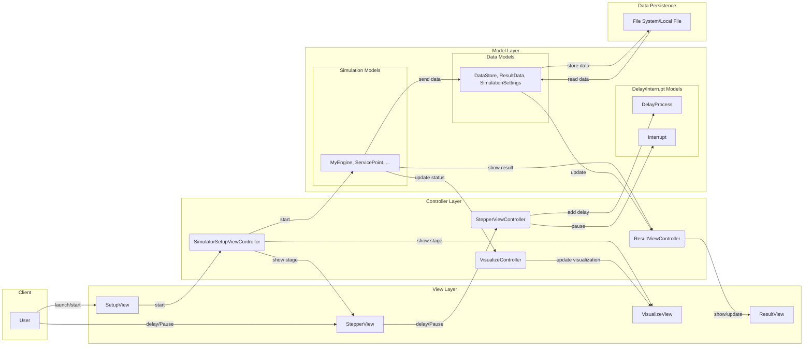

```mermaid
flowchart LR
  %% Client/User section
  subgraph CLIENT["Client"]
    direction TB
    User["User"]
  end

  %% View Layer (left)
  subgraph VIEW["View Layer"]
    direction TB
    V2["SetupView"]
    V3["StepperView"]
    V4["VisualizeView"]
    V1["ResultView"]
  end

  %% Controller Layer (middle)
  subgraph CONTROLLER["Controller Layer"]
    direction TB
    C2("SimulatorSetupViewController")
    C3("StepperViewController")
    C4("VisualizeController")
    C1("ResultViewController")
  end

  %% Model Layer (right)
  subgraph MODEL["Model Layer"]
    direction TB
    %% Model submodules
    subgraph DELAY_INTERRUPT["Delay/Interrupt Models"]
      direction TB
      M_Delay["DelayProcess"]
      M_Interrupt["Interrupt"]
    end
    subgraph DATA_MODELS["Data Models"]
      direction TB
      M_Data["DataStore, ResultData, SimulationSettings"]
    end
    subgraph SIMULATION_MODELS["Simulation Models"]
      direction TB
      M_Simulation["MyEngine, ServicePoint, ..."]
    end
  end

  %% Persistence
  subgraph PERSIST["Data Persistence"]
    direction TB
    DB["File System/Local File"]
  end

  %% Connections, from left to right, grouped for readability

  %% User triggers
  User -- "launch/start" --> V2
  User -- "delay/Pause" --> V3

  %% View -> Controller
  V2 -- "start" --> C2
  V3 -- "delay/Pause" --> C3

  %% Controller interactions
  C2 -- "show stage" --> V3
  C2 -- "show stage" --> V4
  C2 -- "start" --> M_Simulation
  C3 -- "add delay" --> M_Delay
  C3 -- "pause" --> M_Interrupt
  C4 -- "update visualization" --> V4
  C1 -- "show/update" --> V1

  %% Simulation/model interactions
  M_Simulation -- "update status" --> C4
  M_Simulation -- "show result" --> C1
  M_Simulation -- "send data" --> M_Data

  M_Data -- "update" --> C1

  %% Data persistence
  M_Data -- "store data" --> DB
  DB -- "read data" --> M_Data


```
